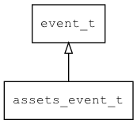

## assets\_event\_t
### 概述


资源事件，由资源管理器触发。
----------------------------------
### 函数
<p id="assets_event_t_methods">

| 函数名称 | 说明 | 
| -------- | ------------ | 
| <a href="#assets_event_t_event_from_name">event\_from\_name</a> | 将事件名转换成事件的值。 |
| <a href="#assets_event_t_window_event_init">window\_event\_init</a> | 初始化事件。 |
### 属性
<p id="assets_event_t_properties">

| 属性名称 | 类型 | 说明 | 
| -------- | ----- | ------------ | 
| <a href="#assets_event_t_asset_info">asset\_info</a> | asset\_info\_t* | 触发事件的资源对象 |
| <a href="#assets_event_t_type">type</a> | asset\_type\_t | 触发事件的资源类型 |
#### event\_from\_name 函数
-----------------------

* 函数功能：

> <p id="assets_event_t_event_from_name">将事件名转换成事件的值。

* 函数原型：

```
int32_t event_from_name (const char* name);
```

* 参数说明：

| 参数 | 类型 | 说明 |
| -------- | ----- | --------- |
| 返回值 | int32\_t | 返回事件的值。 |
| name | const char* | 事件名。 |
#### window\_event\_init 函数
-----------------------

* 函数功能：

> <p id="assets_event_t_window_event_init">初始化事件。

* 函数原型：

```
event_t* window_event_init (window_event_t* event, assets_manager_t* am, uint32_t type, asset_type_t asset_type, asset_info_t* asset_info);
```

* 参数说明：

| 参数 | 类型 | 说明 |
| -------- | ----- | --------- |
| 返回值 | event\_t* | event对象。 |
| event | window\_event\_t* | event对象。 |
| am | assets\_manager\_t* | 事件目标资源管理器。 |
| type | uint32\_t | 事件类型。 |
| asset\_type | asset\_type\_t | 资源类型。 |
| asset\_info | asset\_info\_t* | 资源对象。 |
#### asset\_info 属性
-----------------------
> <p id="assets_event_t_asset_info">触发事件的资源对象

* 类型：asset\_info\_t*

| 特性 | 是否支持 |
| -------- | ----- |
| 可直接读取 | 是 |
| 可直接修改 | 否 |
| 可脚本化   | 是 |
#### type 属性
-----------------------
> <p id="assets_event_t_type">触发事件的资源类型

* 类型：asset\_type\_t

| 特性 | 是否支持 |
| -------- | ----- |
| 可直接读取 | 是 |
| 可直接修改 | 否 |
| 可脚本化   | 是 |
